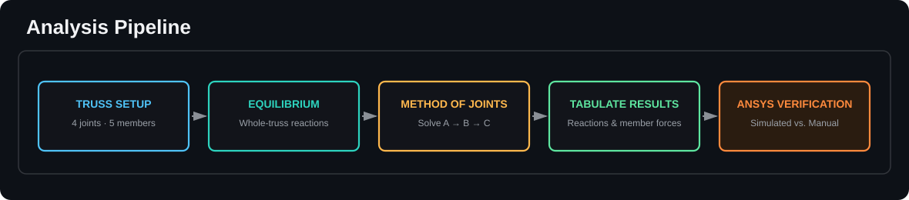
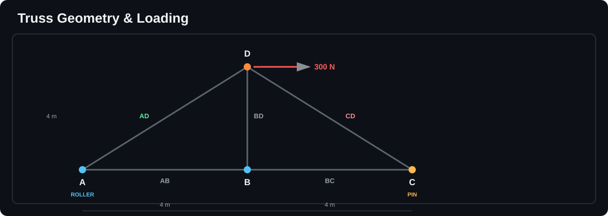
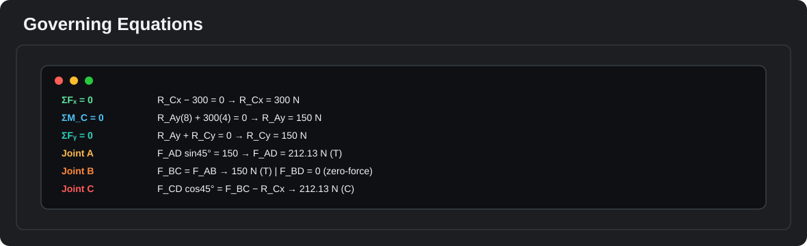
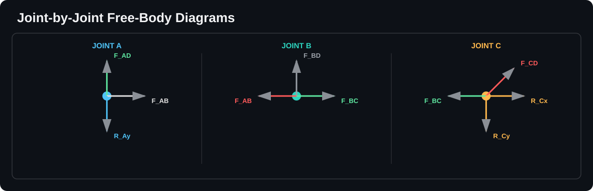
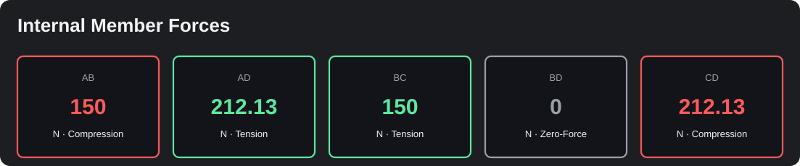
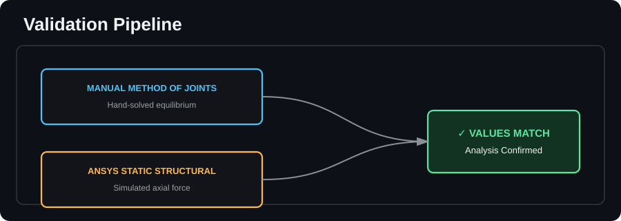
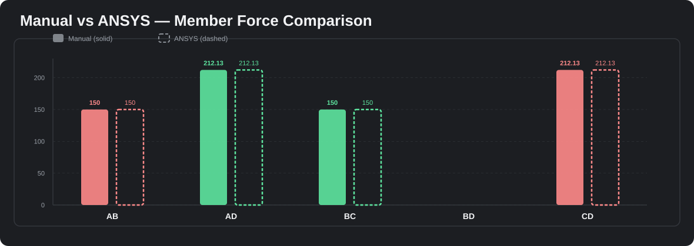
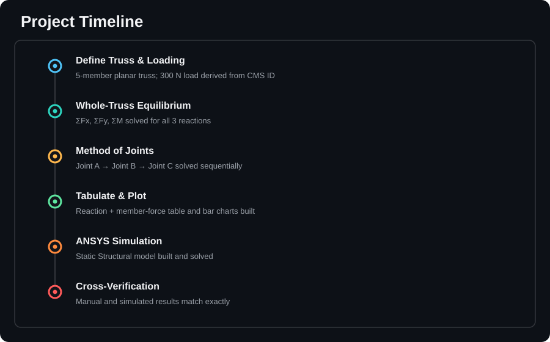
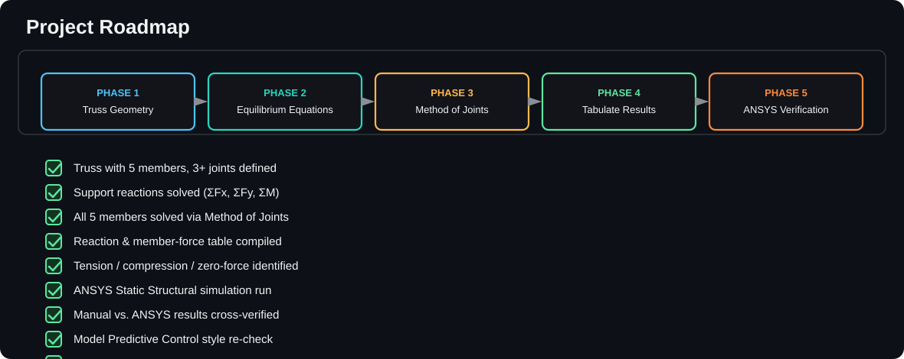

  

<h3 align="center">Design, Analysis, and Simulation Verification of a Statically Determinate Planar Truss</h3>

  
  
  
  

 

##  Introduction

This project presents the static analysis of a five-member, four-joint planar truss, solved analytically using the method of joints and independently verified through finite-element simulation in ANSYS Workbench. The truss is supported by a roller at joint A and a pin at joint C, with a 300 N horizontal load applied at the apex joint D, its magnitude derived directly from a team member's CMS registration number. Working through equilibrium of the whole structure and then joint-by-joint, the reactions and all five internal member forces were calculated by hand, identifying members AD and CD as the critical tension and compression members at 212.13 N, members AB and BC carrying 150 N each, and BD as a true zero-force member. The same geometry and loading were then rebuilt in ANSYS Static Structural, and the simulated axial force distribution matched the hand calculations almost exactly, with a maximum of 212.13 N and a minimum of -212.13 N. This close agreement between the manual and simulated results confirms both the correctness of the equilibrium approach and the reliability of the finite-element model, illustrating how classical hand analysis and modern simulation tools reinforce one another in real structural engineering practice.

 

 

##  Geometry & Loading

 

##  Governing Equations

 

##  Joint-by-Joint Free-Body Diagrams

 

##  Internal Member Forces

 

##  Manual &harr; ANSYS Validation

 

 

##  Project Timeline

 

##  Roadmap

 

##  Repository

| File | Description |
|:--|:--|
| `Project_Report.pdf` | Full IEEE-format lab report |
| `Project_Presentation.pptx` | Presentation slides |
| `assets/` | Diagram source files (SVG) |

 

Autor: Frais Asghar
   
National University of Sciences &amp; Technology (NUST) SMME

 

If this project was useful to you, consider giving it a star. ⭐
  
<p2 align="center">Built for the Mechanical & Simulation community &nbsp;&middot;&nbsp; Happy building</p2>

